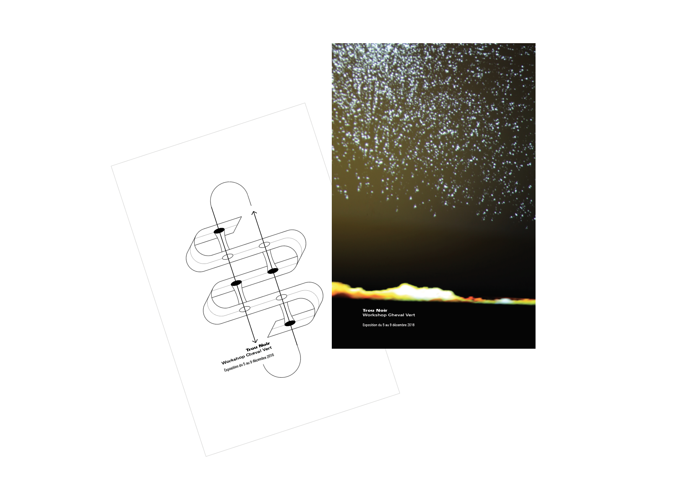

##Trou Noir
####Penser un monde en construction

###### Description

Installation, performance autour du thème du trou noir. Deux spectateurs sont invités à enfiler un casque encéphalographique et une cagoule à retour haptique. L'un se positionne comme créateur d'univers, sur la table vidéo mappée se construit visuellement une synthèse de sa pensée pendant que l'autre reçoit les impulsions cérébrales de son binôme. Tous deux plongés dans le calme, il regarde entre eux le monde qu'ils sont en train de construire.

*Workshop d'un jour et demi avec Stéphane Buellet, Chevalvert. En partenariat avec l'École Boulle.*

###### Auteurs

Marjorie Colin, Céline Mini Boo, Anastasia Diot, Gille de Bast.

###### Photo de l'installation

